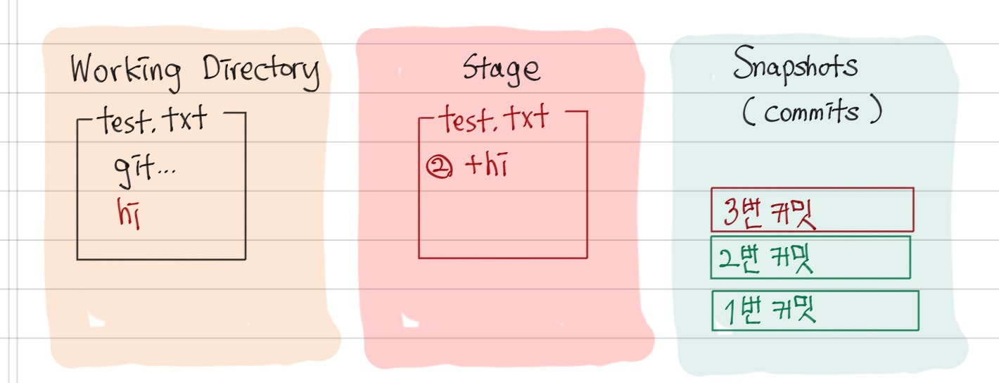
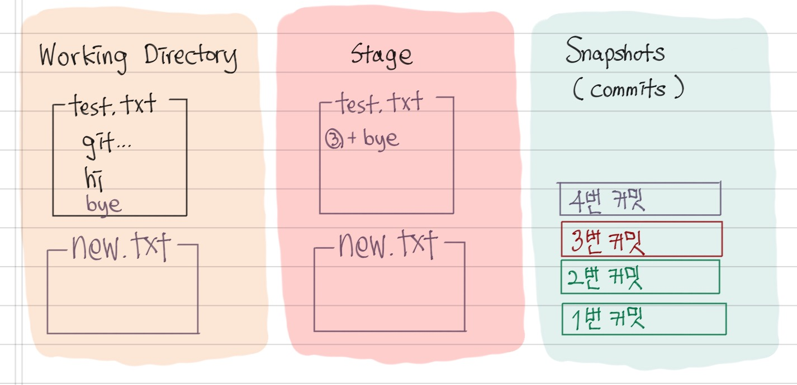
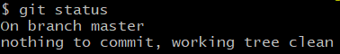
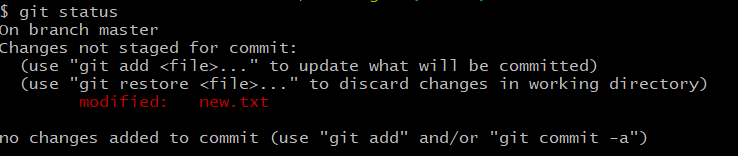
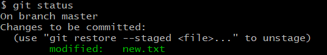
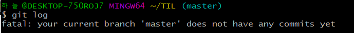

# Git

## What?

VSC (Version Control System)

​	= 버전 관리 시스템

## Why?

파일의 변화를 시간에 따라 기록했다가 나중에 특정 시점의 버전을 다시 꺼내올 수 있도록

## How?

- git을 처음 설치했으면 최초 설정 필요

  `$ git config --global user.name <이름>`
  `$ git config --global user.email <이메일>`

- 'working directory - stage - snapshot(commit)' 으로 구성

- commit : stage에 있는 변경된 내용만 저장

### commit 생성

1. 디렉토리를 git repository로 설정하기

   `$ git init` :  초기화

2. working directory에서 파일 수정

   

3. 변경사항을 stage로 이동

   `$ git add`

   - `$ git add <file/dirname>` : 파일/디렉토리를 stage로
   - `$ git add .` : 현재 위치의 모든 파일을 stage로

   

4. stage 상의 내용을 snapshots로 이동 

   `$ git commit -m "<message>"` 

   - 메세지를 작성하지 않으면 다음과 같은 창 생성

     

     vim과 같은 방식으로 메세지를 작성하고 종료(`Shift : wq`)

#### ex1.

1. working directory의 test.txt 파일에 hi 라는 내용 추가
   `$ git status` 에서 modified (빨간불) 확인 가능
2. `$ git add test.txt` : test.txt에서 변경된 내용을 stage에 추가
   `$ git status` 에서 changes to be committed 확인 가능
3. `$ git commit -m '3번 커밋'` : stage에 있는 내용을 '3번 커밋'으로 저장 (commit 생성)

#### ex2.

1. working directory의 test.txt 파일에 bye 라는 내용 추가
   working directory에 new.txt 파일 생성 (`$ mkdir new.txt`)
2. `$ git add .` : working directory에 있는 모든 파일에서 변경된 내용을 stage에 추가
3. `$ git commit -m '4번 커밋'` : stage에 있는 내용을 '4번 커밋'으로 저장 (commit 생성)

#### Pro Git 2.2 Git의 기초 - 수정하고 저장소에 저장하기

(https://git-scm.com/book/ko/v2/Git%EC%9D%98-%EA%B8%B0%EC%B4%88-%EC%88%98%EC%A0%95%ED%95%98%EA%B3%A0-%EC%A0%80%EC%9E%A5%EC%86%8C%EC%97%90-%EC%A0%80%EC%9E%A5%ED%95%98%EA%B8%B0)

- 파일의 라이프사이클

  

  - modified 상태에서는 `$ git status` 에서 빨간불
  - staged 상태에서는 `$ git status` 에서 파란불

#### 주의사항

- home directory(`~`)를 git repository로 만들게 되면 안된다.

  --> 하위 디렉토리에 git repo가 또 있으면 sub repo가 생성되어 일반적인? git이 아니게 된다.

- `$ git log` 를 통해 5개 이상의 commit이 있으면 q를 눌러 빠져 나온다.

  

### git 명령어

| 명령어                                  | 기능                                 |
| --------------------------------------- | ------------------------------------ |
| `$ git status`                          | 커밋 상태 확인                       |
| `$ git log`                             | 커밋 기록 확인                       |
| `$ git restore <file/dirname>`          | 최종 커밋 상태로 복구                |
| `$ git restore --staged <file/dirname>` | unstaged  (스테이지에서 내리기) |
| `$ git rm --cached <file/dirname>`      | untracked  (추적 멈추기)        |

- `$ git status` 에서 

  - nothing to commit : 변경 사항 없음

  

  

  - Changes not staged for commit & modified(빨간불) : 변경 사항 있지만 stage에 없음

    

    

  - Changes to be committed & modified (파란불) : 변경 사항이 stage에 있음

    

- `$ git log` 에서 
  - commit이 없을 때

- 처음 'initial commit'!!

---

## 참고하면 좋을 것들

- Pro Git

  영어버전 (https://git-scm.com/book/en/v2)

  한글버전 (https://git-scm.com/book/ko/v2)

- The Missing Semester - MIT 

  영어버전 (https://missing.csail.mit.edu/)

  한글버전 (https://missing-semester-kr.github.io/)

- git 핵심 주제어들

  VCS
  폴더(directory)
  저장소(repository)
  .git/
  스테이지(stage area)
  commits
  변경사항
  untracked/tracking
  unmodified
  modified
  staged

