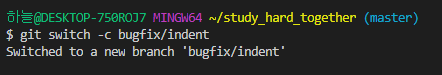

# Github 시작하기

```
$ rm -rf <dir/file>

$ git remote remove <remotename> 

$ git remote add origin <URL> # git remote add <remote_name> <URL>
$ git push origin master # git push <remote_name> <branch>

$ git branch
$ git branch <name>
$ git branch -d <branch>
$ git branch -D <branch>

$ git switch <branch>
$ git switch -c <branch> == $ git checkout -b <branch>

$ git checkout <branch/commit_id>

$ git merge <branch>
```

- remote repo (원격저장소)
- fast forward
- conflict
- 자동 merge/ 수동 merge
- merge commit


로컬 저장소 & 리모트저장소

## git 연결하기

Github에 git 연결

1. 로컬 저장소를 만든다.

   `$ mkdir learn_git/`

2. 커밋을 한다.

   learn_git 디렉토리에서 

   ```
   $ git init
   $ git add .
   $ git commit -m 'test.ver'
   ```

3. 리모트 저장소를 만든다.

   github에서 create a new repository

4. 리모트 저장소를 로컬 저장소에 등록한다.

   `$ git remote add origin <MY REMOTE URL>`

5. PUSH

   `$ git push origin master `


## branch

실험적인 코드를 작성하거나 팀원들과 코드를 따로 작성할 때 new branch를 이용

### branch 생성

`$ git branch <branch>`

### branch 병합

`$ git merge <branch>`

마스터 브랜치에 다른 브랜치(about)를 병합

```
(master)
$ git merge about
```


#### 병합의 종류

##### fast forward (no merge commit)

master 브랜치가 다른 브랜치로 빠르게 이동


##### auto merge commit

갈래에서 auto-merging

merge commit 발생


##### conflict => manual merge commit

Merge하는 두 브랜치에서 같은 파일의 한 부분을 동시에 수정하게 되면 충돌 발생

=> 수동으로 수정후 commit

```
$ git merge conf
Auto-merging README.md
CONFLICT (content): Merge conflict in README.md
Automatic merge failed; fix conflicts and then commit the result.

# 수동 수정

$ git add .

$ git status
On branch master
All conflicts fixed but you are still merging.
  (use "git commit" to conclude merge)

$ git commit -m 'conflited merge'
[master 5cd4334] conflited merge

$ git log --pretty=format:"%h %s" --graph
*   5cd4334 conflited merge
|\
| * 430373d conf꺼


```


### branch 삭제

지나온 브랜치는 지우는게 좋다


1. `$ git branch -d <branch>`
   - 변경사항이 없을 때 사용
2. `$ git branch -D <branch>`
   - 새로 생성한 commit이 있을 때 사용
   - 강제 삭제 같은 느낌


## 협업하기

### A.

git 연결하기

branch 생성하기



commit 생성하기

github에 push하기


### B.

## SUMMARY

### 리모트 저장소

| 코드                                                         | 기능                                                         |
| ------------------------------------------------------------ | ------------------------------------------------------------ |
| `$ git reomote`                                              | 현재 프로젝트에 등록된 리모트 저장소                         |
| `$ git clone <URL>`                                          | origin이라는 리모트 저장소가 자동으로 등록                   |
| `$ git remote -v`                                            | 단축이름과 URL 확인                                          |
| `$ git remote add <단축이름> <URL>`                          | 기존 워킹 디렉토리에 새 리모트 저장소 추가                   |
| `$ git remote rename <기존이름> <바꿀이름>`                  | 리모트 저장소의 이름 변경                                    |
| `$ git remote rm <remote>`                                   | 리모트 저장소 삭제                                           |
| `$ git pull origin master` <br />=> `$ git pull <remote> <branch>` | 로컬에는 없지만, 리모트 저장소에 있는 데이터를 모두 가져오기 |
| `$ git push origin master`<br />=>`$ git push <remote> <branch>` | 리모트 저장소에 push 하기                                    |

 

### Git 브랜치

| 코드                                                         | 기능                                         |
| ------------------------------------------------------------ | -------------------------------------------- |
| `$ git branch`                                               | 브랜치 목록 확인                             |
| `$ git branch <branch>`                                      | 새 브랜치 생성                               |
| `$ git switch <branch>`                                      | 다른 브랜치로 HEAD 이동 (new)                |
| `$ git switch -c <branch>`<br /> ==` $ git checkout -b <branch>` | 새 브랜치를 생성하고 해당 브랜치로 HEAD 이동 |
| `$ git checkout <branch>`                                    | 다른 브랜치로 HEAD 이동                      |
| `$ git checkout <commit_id>`                                 | commit_id로 HEAD 이동                        |
| `$ git merge <branch>`                                       | master 브랜치에 merge                        |
| `$ git branch -d/D <branch>`                                 | 브랜치 삭제/강제삭제                         |
| `$ git log --pretty=format:"%h %s" --graph`                  | 그래프 형태 git log                          |

